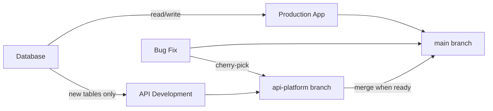

# Commission Intelligence Platform Strategy
**Created**: January 27, 2025  
**Last Updated**: January 27, 2025  
**Status**: Strategic Vision - API-First Architecture  
**Version**: 2.0

## Executive Summary

This document outlines the strategic transformation of Sales Commission Tracker from a standalone application to the industry's first **Commission Intelligence Platform** - an API-first, best-in-class solution that integrates seamlessly into modern insurance agency tech stacks. Rather than competing with established AMS platforms, we position ourselves as the essential commission and policy lifecycle intelligence layer that makes every other system smarter.

### Implementation Status (as of January 2025)
**Current Phase**: Phase 1 - Foundation (Week 1 of 8)  
**Progress**: Core infrastructure components completed
- ✅ Authentication system (JWT, OAuth2, API keys)
- ✅ Rate limiting middleware
- ✅ Monitoring infrastructure (Prometheus)
- ✅ Webhook queue system
- ⏳ Database migrations (next)
- ⏳ API documentation (next)

### Key Strategic Shift:
**From**: Building another monolithic agency management system  
**To**: Becoming the best-in-class commission intelligence API platform

### Core Insight:
Modern insurance agencies are moving away from monolithic systems toward **composable architectures** using best-of-breed solutions connected via APIs. We will be the commission intelligence spoke that every modern agency needs in their tech stack wheel.

## Industry Analysis: The Composable Revolution

### The Current State of Insurance Technology

Based on comprehensive industry research, the insurance technology landscape is undergoing a fundamental transformation:

#### 1. **The Death of Monolithic Systems**
According to industry analysis:
- "The sun is setting on the legacy monolithic system architecture"
- Agencies trapped in 30-year-old systems (QQ Catalyst, AMS360)
- Changes take months and cost fortunes
- Integration is painful, APIs are afterthoughts

#### 2. **The Rise of MACH Architecture**
The industry is shifting to composable technology built on **MACH principles**:
- **Microservices**: Collection of small services replacing monolithic applications
- **API-first**: Microservices communicate via API technology
- **Cloud-native**: 'Always-on' cloud architecture for effortless scaling
- **Headless**: UI separated from business logic

According to Gartner: "By 2023, organizations that have adopted an intelligent composable approach will outpace competition by 80% in the speed of new feature implementation."

#### 3. **The Integration Challenge**
Current integration problems agencies face:
- "We are in desperate need of better access to CRMs like HubSpot, but our industry-leading CRMs do not connect" 
- Manual data entry between 5-10 different systems
- No single system handles everything effectively
- APIs are vital but poorly implemented in legacy systems

### Modern Agency Tech Stack Reality (2024)

Our research revealed the typical modern insurance agency uses:

```
Current Agency Tech Stack Components:
━━━━━━━━━━━━━━━━━━━━━━━━━━━━━━━━━━━

🏢 AGENCY MANAGEMENT SYSTEM (AMS)
├── Applied Epic, EZLynx, HawkSoft, AMS360
├── Market Reality: "Nearly universal use regardless of agency size"
└── Pain Point: Commission tracking is an afterthought

🎯 CRM & MARKETING  
├── HubSpot, Salesforce, Zoho
├── Trend: "If you need automation and low lift, HubSpot and Zoho are solid picks"
└── Pain Point: Poor integration with AMS systems

💰 COMPARATIVE RATER
├── EZLynx Rater, TurboRater, PL Rating, Quote Rush
├── Capability: "Compare quotes from multiple carriers within seconds"
└── Pain Point: No post-sale tracking

📊 COMMISSION TRACKING
├── Excel spreadsheets (majority)
├── AMS built-in (inadequate)
└── Pain Point: 80% manual reconciliation time

💳 ACCOUNTING
├── QuickBooks, Xero
└── Pain Point: Manual commission data entry
```

### The API Integration Landscape

#### Current Integration Capabilities:

**EZLynx** (Now Part of Applied Systems):
- "EZLynx APIs provide agencies with necessary tools from simple data transfer to complete backend rating"
- Integrates with 525+ insurers nationwide
- API architecture delivers highest level of efficiency and security

**Applied Systems**:
- "Ivans connectivity technology links every phase of the insurance lifecycle"
- Applied Pay® is AMS-native with direct integrations

**HawkSoft**:
- "Clean and reliable, but fewer integrations"
- "Integration with third-party applications could be improved"

**HubSpot**:
- "Integrates with 500+ applications through native integrations and APIs"
- "Most insurance companies operational within 2-4 weeks"

## Our Strategic Positioning: The Commission Intelligence Layer

### Why "Commission Intelligence Platform" Wins

#### 1. **We Solve What Nobody Else Does Well**
- AMS systems treat commissions as afterthought
- CRMs don't understand policy lifecycles
- Raters don't track post-sale activity
- Accounting systems need manual entry
- **This gap is our opportunity**

#### 2. **Every Agency Needs This**
- 100% of agencies reconcile commissions
- 100% of agents need renewal tracking
- 100% of policies have lifecycles
- 100% of commissions need attribution

#### 3. **We Enhance, Not Replace**
Unlike monolithic systems, we:
- Make their AMS commission-aware
- Give their CRM renewal intelligence
- Provide their accounting perfect data
- Feed their dashboards performance metrics

### Our Place in the Modern Stack

```
Modern Insurance Agency Tech Stack 2025
Where Commission Intelligence Platform Fits
━━━━━━━━━━━━━━━━━━━━━━━━━━━━━━━━━━━━━━━━

        ┌─────────────────────────┐
        │    Agency Dashboard     │
        │  (Custom/BI Platform)   │
        └───────────┬─────────────┘
                    │ Consumes All Data
    ┌───────────────┴───────────────────┐
    │                                   │
┌───▼────────┐  ┌──────────────┐  ┌────▼────────┐
│    CRM     │  │ COMMISSION   │  │    AMS      │
│ HubSpot/   │◄─┤ INTELLIGENCE ├─►│  Applied/   │
│ Salesforce │  │   PLATFORM   │  │  EZLynx     │
└────────────┘  │   (US!)      │  └─────────────┘
                │              │
┌────────────┐  │              │  ┌─────────────┐
│   Rater    │◄─┤  * APIs     ├─►│ Accounting  │
│ TurboRater │  │  * Webhooks │  │ QuickBooks  │
│ EZLynx     │  │  * Intelligence│ └─────────────┘
└────────────┘  └──────────────┘
```

### Value Propositions by Stakeholder

#### For Insurance Agencies:
- **"Make Every System Commission-Aware"**
- Reduce reconciliation time by 80%
- Catch missing commissions automatically
- Real-time performance visibility
- No system replacement required

#### For Software Vendors:
- **"Powered by Commission Intelligence"**
- Enhance your platform with our APIs
- Offer advanced commission features
- No development required
- Revenue sharing opportunities

#### For Individual Agents:
- **"Your Commission Command Center"**
- See earnings in real-time
- Track performance against peers
- Never miss a renewal
- Build commission history

## Technical Architecture: API-First Design

### Core Platform Services

```
Commission Intelligence Microservices Architecture
━━━━━━━━━━━━━━━━━━━━━━━━━━━━━━━━━━━━━━━━━━━━━

┌─────────────────────────────────────────────┐
│          API Gateway (Kong/AWS)             │
│     Rate Limiting | Auth | Routing          │
└─────────────┬───────────────────────────────┘
              │
  ┌───────────┴───────────┬─────────────────┐
  │                       │                 │
┌─▼──────────────┐  ┌─────▼──────┐  ┌──────▼─────┐
│ Policy Service │  │ Commission │  │ Analytics  │
│ - Lifecycle    │  │  Service   │  │  Service   │
│ - Renewals     │  │ - Calc     │  │ - Reports  │
│ - Documents    │  │ - Splits   │  │ - Insights │
└────────────────┘  └────────────┘  └────────────┘
  │                       │                 │
┌─▼──────────────┐  ┌─────▼──────┐  ┌──────▼─────┐
│ Reconciliation │  │Integration │  │Notification│
│    Service     │  │  Service   │  │  Service   │
│ - Matching     │  │ - Adapters │  │ - Webhooks │
│ - Statements   │  │ - Queue    │  │ - Events   │
└────────────────┘  └────────────┘  └────────────┘
```

### API Design Philosophy

#### RESTful API Structure:
```javascript
// Base URL: https://api.commissiontracker.io/v1

// Policy Lifecycle Management
POST   /policies                    // Create policy
GET    /policies/{id}              // Get policy details
PUT    /policies/{id}              // Update policy
GET    /policies/{id}/timeline     // Get policy history
POST   /policies/{id}/renew        // Create renewal

// Commission Intelligence
GET    /commissions/calculate      // Calculate commissions
POST   /commissions/reconcile      // Reconcile statement
GET    /commissions/pending        // Get pending commissions
GET    /commissions/analytics      // Performance analytics

// Integration Endpoints
POST   /webhooks/register          // Register webhook
POST   /sync/ams                   // Sync from AMS
POST   /sync/crm                   // Sync from CRM
GET    /export/accounting          // Export to accounting

// Real-time Updates
WS     /realtime/subscribe         // WebSocket subscriptions
```

#### GraphQL for Complex Queries:
```graphql
query AgencyPerformance($agencyId: ID!, $dateRange: DateRange!) {
  agency(id: $agencyId) {
    agents {
      id
      name
      performance(dateRange: $dateRange) {
        totalCommission
        policyCount
        renewalRate
        ranking
      }
    }
    topPolicies(limit: 10) {
      policyNumber
      premium
      commission
      agent
    }
  }
}
```

### Integration Framework

#### Inbound Integrations (Data We Consume):

**From AMS Systems:**
```javascript
// Applied Epic / EZLynx / HawkSoft
POST /api/v1/inbound/ams/policy
{
  "source": "applied_epic",
  "action": "policy_issued",
  "data": {
    "policy_number": "HOME-123456",
    "effective_date": "2025-09-01",
    "expiration_date": "2026-01-01",
    "premium": 1200.00,
    "client_id": "CLIENT-789",
    "coverages": [{...}]
  }
}
```

**From Comparative Raters:**
```javascript
// EZLynx / TurboRater / PL Rating
POST /api/v1/inbound/rater/quote-sold
{
  "source": "turborater",
  "quote_id": "QUOTE-456789",
  "policy_data": {
    "carrier": "Progressive",
    "premium": 800.00,
    "commission_rate": 0.12,
    "agent_id": "AGENT-123"
  }
}
```

**From CRM Systems:**
```javascript
// HubSpot / Salesforce
POST /api/v1/inbound/crm/contact-update
{
  "source": "hubspot",
  "contact_id": "HS-123456",
  "updates": {
    "renewal_date": "2025-06-01",
    "preferred_contact": "email",
    "risk_changes": [{...}]
  }
}
```

#### Outbound Integrations (Intelligence We Provide):

**To Accounting Systems:**
```javascript
// QuickBooks / Xero
GET /api/v1/outbound/accounting/commissions
Response: {
  "period": "2025-01",
  "entries": [{
    "date": "2025-09-31",
    "account": "Commission Income",
    "amount": 25432.10,
    "breakdown": [{
      "agent": "John Smith",
      "amount": 5432.10,
      "policies": [...]
    }]
  }]
}
```

**To CRM Systems:**
```javascript
// Renewal Intelligence Feed
GET /api/v1/outbound/crm/renewal-intelligence
Response: {
  "upcoming_renewals": [{
    "contact_id": "CRM-123",
    "policy_number": "AUTO-789",
    "renewal_date": "2025-03-15",
    "renewal_probability": 0.92,
    "recommended_actions": [
      "Contact 30 days prior",
      "Quote comparison suggested"
    ]
  }]
}
```

**To Analytics Dashboards:**
```javascript
// Real-time Performance Metrics
GET /api/v1/outbound/analytics/performance
Response: {
  "timestamp": "2025-09-27T10:00:00Z",
  "metrics": {
    "agency_totals": {
      "mtd_commission": 125000.00,
      "ytd_commission": 125000.00,
      "active_policies": 2341
    },
    "agent_leaderboard": [{
      "rank": 1,
      "agent": "Sarah Johnson",
      "mtd_commission": 15234.00,
      "streak_days": 12,
      "badges": ["top_producer", "renewal_master"]
    }]
  }
}
```

### Webhook Architecture

```javascript
// Webhook Registration
POST /api/v1/webhooks/register
{
  "url": "https://agency.com/webhooks/commission-tracker",
  "events": [
    "policy.created",
    "policy.renewed", 
    "commission.calculated",
    "commission.paid",
    "renewal.upcoming"
  ],
  "secret": "webhook_secret_key"
}

// Webhook Payload Example
POST https://agency.com/webhooks/commission-tracker
{
  "event": "commission.calculated",
  "timestamp": "2025-09-27T10:00:00Z",
  "data": {
    "policy_number": "HOME-123",
    "commission_amount": 120.00,
    "agent_id": "AGENT-456",
    "calculation_details": {...}
  },
  "signature": "sha256=abcd..."
}
```

## Implementation Safety: Zero-Risk Development

### Overview
We will build the Commission Intelligence Platform using a parallel branch strategy that ensures:
- Current production app remains untouched
- Safe extensions to existing database
- Complete rollback capability
- Gradual feature rollout

### Development Approach: Parallel Branch Strategy

#### GitHub Branch Architecture:
```
Repository Structure:
├── main (production - solo agent app)
│   └── Current 19,000 lines remain untouched
└── api-platform (new development branch)
    ├── All API development
    ├── Platform features
    └── Can be merged when ready
```

#### Branch Management:
```bash
# Initial setup (one time)
git checkout main
git pull origin main
git checkout -b api-platform
git push -u origin api-platform

# Daily workflow
git checkout api-platform  # Work on API features
# OR
git checkout main         # Fix production bugs only

# Cherry-pick critical fixes
git checkout api-platform
git cherry-pick <commit-hash-from-main>
```

### Database Strategy: Safe PROD Extensions

#### Key Principles:
1. **Same Supabase Instance** - Cost-effective, single database
2. **Only Additive Changes** - New tables and nullable columns only
3. **Complete Isolation** - API features don't affect current app
4. **Rollback Ready** - Every change has a reversal script

#### Safe Database Migrations:
```sql
-- All new tables for API platform
CREATE TABLE IF NOT EXISTS api_keys (
    id UUID PRIMARY KEY DEFAULT gen_random_uuid(),
    user_email VARCHAR(255) REFERENCES users(email),
    api_key VARCHAR(255) UNIQUE NOT NULL,
    name VARCHAR(255),
    permissions JSONB DEFAULT '{}',
    rate_limit INTEGER DEFAULT 1000,
    created_at TIMESTAMP DEFAULT NOW(),
    last_used TIMESTAMP,
    is_active BOOLEAN DEFAULT true
);

CREATE TABLE IF NOT EXISTS webhook_endpoints (
    id UUID PRIMARY KEY DEFAULT gen_random_uuid(),
    user_email VARCHAR(255) REFERENCES users(email),
    url VARCHAR(500) NOT NULL,
    events TEXT[] NOT NULL,
    secret VARCHAR(255),
    is_active BOOLEAN DEFAULT true,
    created_at TIMESTAMP DEFAULT NOW()
);

-- Add API tracking columns (all nullable)
ALTER TABLE policies ADD COLUMN IF NOT EXISTS api_source VARCHAR(50);
ALTER TABLE policies ADD COLUMN IF NOT EXISTS last_api_sync TIMESTAMP;
ALTER TABLE policies ADD COLUMN IF NOT EXISTS external_id VARCHAR(255);

-- Rollback script ready
/*
DROP TABLE IF EXISTS webhook_endpoints;
DROP TABLE IF EXISTS api_keys;
ALTER TABLE policies DROP COLUMN IF EXISTS api_source;
ALTER TABLE policies DROP COLUMN IF EXISTS last_api_sync;
ALTER TABLE policies DROP COLUMN IF EXISTS external_id;
*/
```

### Zero-Risk Development Principles

#### 1. **Current App Isolation**
- Main branch code never touched
- No imports from api-platform code
- Current app continues working unchanged
- All API code in separate modules

#### 2. **Feature Flag Control**
```python
# config.py
API_PLATFORM_ENABLED = os.getenv("API_PLATFORM_ENABLED", "false").lower() == "true"
WEBHOOKS_ENABLED = os.getenv("WEBHOOKS_ENABLED", "false").lower() == "true"
PUBLIC_API_ENABLED = os.getenv("PUBLIC_API_ENABLED", "false").lower() == "true"

# In main app
if API_PLATFORM_ENABLED:
    # Import and initialize API routes
    from api_platform import init_api_routes
    init_api_routes(app)
```

#### 3. **Gradual Rollout Strategy**
1. **Phase 1**: Internal testing only (feature flags OFF)
2. **Phase 2**: Beta users get API access
3. **Phase 3**: All users can opt-in to API
4. **Phase 4**: API becomes default (main still works)

#### 4. **Testing Without Risk**
```python
# Separate test environment variables
if os.getenv("TEST_MODE") == "true":
    # Use test database tables
    TABLE_PREFIX = "test_"
else:
    TABLE_PREFIX = ""

# This ensures test data never touches production
```

### Deployment Safety

#### Separate Deployments:
1. **Production** (Current)
   - Deployed from `main` branch
   - No API code included
   - Continues as-is

2. **API Platform** (New)
   - Deployed from `api-platform` branch
   - Separate URL: `api.commissiontracker.io`
   - Own monitoring and logs

#### Monitoring & Rollback:
- All API changes logged separately
- Database changes reversible
- Feature flags for instant disable
- No production impact if API fails

### Development Workflow



This approach ensures:
- ✅ Production app never breaks
- ✅ Can develop at full speed
- ✅ Easy rollback if needed
- ✅ Customer data always safe
- ✅ Gradual, controlled rollout

## Critical Gap Analysis

### Current State (15-20% Complete)
Based on code review, we have basic prototypes but lack production-ready components:

#### What's Built:
- ✅ Basic API structure (FastAPI)
- ✅ Simple dashboard UI
- ✅ Database schema
- ✅ 2 integration examples
- ✅ Basic SDK templates

#### Critical Missing Components:
- ❌ Real authentication system
- ❌ Rate limiting infrastructure
- ❌ Queue system for reliability
- ❌ Monitoring and alerting
- ❌ Data validation and sanitization
- ❌ Production deployment configuration
- ❌ Legal compliance framework
- ❌ 90% of planned integrations

### Realistic Resource Requirements

#### Team Needed:
- **Lead Developer**: API architecture, core platform
- **Integration Developer**: Partner APIs, webhooks
- **DevOps Engineer**: Infrastructure, monitoring, deployment
- **QA Engineer**: Testing, security audits
- **Technical Writer**: Documentation, SDK examples

#### Timeline Reality:
- **MVP (Core API)**: 6 months
- **Integration Phase**: 12 months (2-3 per month)
- **Production Ready**: 18 months
- **Market Leader**: 24-36 months

## Implementation Roadmap (Revised)

### Phase 1: Foundation (Months 1-6)
**Goal**: Build production-grade API infrastructure

#### Technical Deliverables:
- [ ] API Gateway setup (Kong or AWS API Gateway)
- [ ] Core microservices architecture
- [ ] Authentication & authorization (OAuth 2.0)
- [ ] Rate limiting and usage tracking
- [ ] Basic webhook infrastructure
- [ ] API documentation (OpenAPI 3.0)

#### Business Deliverables:
- [ ] Developer portal launch
- [ ] API pricing model
- [ ] Partnership framework
- [ ] Integration certification program

### Phase 2: Core Integrations (Months 4-6)
**Goal**: Build integrations with major platforms

#### Priority 1 Integrations:
- [ ] **EZLynx API** (525+ carriers)
  - Policy sync
  - Commission download
  - Real-time updates
  
- [ ] **Applied Epic**
  - Epic API integration
  - Download automation
  - Workflow triggers

- [ ] **HubSpot**
  - Contact sync
  - Renewal workflows
  - Custom properties

- [ ] **QuickBooks Online**
  - Journal entries
  - Invoice creation
  - Payment tracking

#### Priority 2 Integrations:
- [ ] HawkSoft
- [ ] AMS360
- [ ] Salesforce
- [ ] TurboRater
- [ ] Xero

### Phase 3: Intelligence Layer (Months 7-9)
**Goal**: Add AI-powered insights and automation

#### Analytics Features:
- [ ] Predictive renewal scoring
- [ ] Commission optimization recommendations  
- [ ] Anomaly detection
- [ ] Performance insights
- [ ] Market benchmarking

#### Automation Features:
- [ ] Smart reconciliation matching
- [ ] Automated commission calculations
- [ ] Workflow triggers
- [ ] Intelligent alerts

### Phase 4: Platform Ecosystem (Months 10-12)
**Goal**: Build thriving integration ecosystem

#### Marketplace Development:
- [ ] Partner integration store
- [ ] Revenue sharing model
- [ ] Certification program
- [ ] Co-marketing opportunities

#### Advanced Features:
- [ ] Custom workflow builder
- [ ] Advanced analytics API
- [ ] White-label options
- [ ] Enterprise features

## Go-to-Market Strategy

### Positioning Statement
**"The Commission Intelligence Platform that makes every insurance system smarter"**

### Target Market Segments

#### 1. **Forward-Thinking Agencies** (Primary)
- 10-50 agents
- Already using modern tools (HubSpot, cloud-based systems)
- Frustrated with manual processes
- Value: 80% time savings on reconciliation

#### 2. **Tech-Forward MGAs/Wholesalers**
- Need multi-carrier reconciliation
- Complex commission structures
- Value: Automated downstream agent payments

#### 3. **Software Vendors** (Partnership)
- AMS providers wanting better commission features
- CRM vendors needing insurance capabilities
- Raters wanting post-sale intelligence
- Value: Instant feature enhancement

### Competitive Advantages

#### vs. Traditional AMS (QQ, AMS360):
- **Modern**: API-first vs 30-year-old architecture
- **Focused**: Commission excellence vs trying everything
- **Fast**: 2-week implementation vs 6-12 months
- **Affordable**: Usage-based vs massive licenses

#### vs. Doing Nothing (Excel):
- **Automated**: 80% reduction in manual work
- **Accurate**: No formula errors
- **Scalable**: Grows with agency
- **Auditable**: Complete trail

#### vs. Building In-House:
- **Immediate**: Available now vs years to build
- **Maintained**: Continuous updates
- **Integrated**: Pre-built connectors
- **Proven**: Tested algorithms

### Partnership Strategy

#### Technology Partners:
1. **"Powered by Commission Intelligence"** certification
2. White-label API options
3. Revenue sharing on referrals
4. Joint go-to-market

#### Industry Partners:
1. Insurance associations
2. Agency networks (SIAA, etc.)
3. Industry consultants
4. Training organizations

### Pricing Evolution

#### Current Model:
- Solo agents: $X/month
- Simple, predictable

#### Platform Model:
```
Pricing Tiers (Monthly):
━━━━━━━━━━━━━━━━━━━━━━

Starter (1-5 agents)
- $199/month
- 1,000 API calls
- Basic integrations

Professional (6-20 agents)  
- $499/month
- 10,000 API calls
- All integrations
- Webhooks

Enterprise (20+ agents)
- Custom pricing
- Unlimited API calls
- White label options
- Dedicated support

API Only (Vendors)
- $0.10 per API call
- Volume discounts
- Revenue sharing available
```

## Success Metrics

### Technical KPIs:
- API uptime: 99.9%
- Response time: <200ms
- Integration count: 20+
- API calls/month: 1M+

### Business KPIs:
- Agencies on platform: 100+
- Total agents served: 1,000+
- API partners: 10+
- Platform GMV: $10M+

### User Success Metrics:
- Reconciliation time: -80%
- Commission accuracy: 99.9%
- User satisfaction: 4.5+ stars
- Feature adoption: 70%+

## Risk Mitigation

### Technical Risks:

#### API Reliability:
- **Mitigation**: Multi-region deployment, circuit breakers, graceful degradation

#### Data Security:
- **Mitigation**: SOC 2 compliance, encryption at rest/transit, audit logs

#### Integration Complexity:
- **Mitigation**: Standardized adapters, robust error handling, retry logic

### Business Risks:

#### Vendor Lock-in Concerns:
- **Mitigation**: Data portability guarantee, open API standards

#### Competition:
- **Mitigation**: Focus on commission excellence, rapid innovation

#### Market Education:
- **Mitigation**: Content marketing, case studies, free trials

## The Path Forward

### Immediate Actions (Next 30 Days):
1. Design API specification
2. Set up API gateway infrastructure  
3. Create developer documentation
4. Build first integration prototype
5. Develop partnership framework

### Quick Wins (60-90 Days):
1. Launch developer portal
2. Release first integration
3. Sign first API partner
4. Publish API documentation
5. Demo at industry event

### Major Milestones (Year 1):
- Q1: API platform launch
- Q2: 5+ integrations live
- Q3: First enterprise client
- Q4: 100+ agencies on platform

## Production-Ready Components (Critical Missing Pieces)

### 1. Authentication & Authorization System

```python
# api_platform/auth/authentication.py
import jwt
import secrets
from datetime import datetime, timedelta
from typing import Optional, Dict, Any
from fastapi import HTTPException, Security, Depends
from fastapi.security import HTTPBearer, HTTPAuthorizationCredentials
import bcrypt
from functools import lru_cache
import redis

# Redis for token blacklist and rate limiting
redis_client = redis.Redis(host='localhost', port=6379, decode_responses=True)

class AuthenticationService:
    """Production-ready authentication service with JWT tokens."""
    
    def __init__(self):
        self.secret_key = os.getenv("JWT_SECRET_KEY", secrets.token_urlsafe(32))
        self.algorithm = "HS256"
        self.access_token_expire_minutes = 30
        self.refresh_token_expire_days = 30
        
    def create_access_token(self, data: Dict[str, Any]) -> str:
        """Create JWT access token."""
        to_encode = data.copy()
        expire = datetime.utcnow() + timedelta(minutes=self.access_token_expire_minutes)
        to_encode.update({"exp": expire, "type": "access"})
        
        return jwt.encode(to_encode, self.secret_key, algorithm=self.algorithm)
    
    def create_refresh_token(self, data: Dict[str, Any]) -> str:
        """Create JWT refresh token."""
        to_encode = data.copy()
        expire = datetime.utcnow() + timedelta(days=self.refresh_token_expire_days)
        to_encode.update({"exp": expire, "type": "refresh"})
        
        return jwt.encode(to_encode, self.secret_key, algorithm=self.algorithm)
    
    def verify_token(self, token: str, token_type: str = "access") -> Dict[str, Any]:
        """Verify and decode JWT token."""
        # Check if token is blacklisted
        if redis_client.sismember("blacklisted_tokens", token):
            raise HTTPException(status_code=401, detail="Token has been revoked")
        
        try:
            payload = jwt.decode(token, self.secret_key, algorithms=[self.algorithm])
            if payload.get("type") != token_type:
                raise HTTPException(status_code=401, detail="Invalid token type")
            return payload
        except jwt.ExpiredSignatureError:
            raise HTTPException(status_code=401, detail="Token has expired")
        except jwt.JWTError:
            raise HTTPException(status_code=401, detail="Could not validate token")
    
    def revoke_token(self, token: str):
        """Add token to blacklist."""
        # Add to blacklist with expiration
        payload = jwt.decode(token, self.secret_key, algorithms=[self.algorithm], 
                           options={"verify_exp": False})
        ttl = payload["exp"] - datetime.utcnow().timestamp()
        if ttl > 0:
            redis_client.setex(f"blacklist:{token}", int(ttl), "1")
            redis_client.sadd("blacklisted_tokens", token)

# OAuth2 implementation for third-party integrations
class OAuth2Service:
    """Handle OAuth2 flows for partner integrations."""
    
    def __init__(self):
        self.providers = {
            "hubspot": {
                "client_id": os.getenv("HUBSPOT_CLIENT_ID"),
                "client_secret": os.getenv("HUBSPOT_CLIENT_SECRET"),
                "authorize_url": "https://app.hubspot.com/oauth/authorize",
                "token_url": "https://api.hubapi.com/oauth/v1/token"
            },
            "salesforce": {
                "client_id": os.getenv("SALESFORCE_CLIENT_ID"),
                "client_secret": os.getenv("SALESFORCE_CLIENT_SECRET"),
                "authorize_url": "https://login.salesforce.com/services/oauth2/authorize",
                "token_url": "https://login.salesforce.com/services/oauth2/token"
            }
        }
    
    def get_authorization_url(self, provider: str, redirect_uri: str, state: str) -> str:
        """Generate OAuth2 authorization URL."""
        config = self.providers.get(provider)
        if not config:
            raise ValueError(f"Unknown provider: {provider}")
        
        params = {
            "client_id": config["client_id"],
            "redirect_uri": redirect_uri,
            "response_type": "code",
            "state": state,
            "scope": self._get_scope(provider)
        }
        
        return f"{config['authorize_url']}?" + urlencode(params)
    
    async def exchange_code_for_token(self, provider: str, code: str, redirect_uri: str):
        """Exchange authorization code for access token."""
        config = self.providers.get(provider)
        if not config:
            raise ValueError(f"Unknown provider: {provider}")
        
        async with aiohttp.ClientSession() as session:
            data = {
                "grant_type": "authorization_code",
                "code": code,
                "redirect_uri": redirect_uri,
                "client_id": config["client_id"],
                "client_secret": config["client_secret"]
            }
            
            async with session.post(config["token_url"], data=data) as response:
                if response.status == 200:
                    return await response.json()
                else:
                    raise HTTPException(status_code=400, detail="Failed to exchange code")
```

### 2. Rate Limiting Infrastructure

```python
# api_platform/middleware/rate_limiting.py
import time
from typing import Dict, Tuple
from fastapi import Request, HTTPException
from starlette.middleware.base import BaseHTTPMiddleware
import redis
from datetime import datetime, timedelta

class RateLimitMiddleware(BaseHTTPMiddleware):
    """Advanced rate limiting with multiple strategies."""
    
    def __init__(self, app, redis_client: redis.Redis):
        super().__init__(app)
        self.redis = redis_client
        
        # Rate limit configurations by plan
        self.rate_limits = {
            "free": {"requests": 100, "window": 3600},      # 100/hour
            "starter": {"requests": 1000, "window": 3600},  # 1000/hour
            "professional": {"requests": 10000, "window": 3600}, # 10k/hour
            "enterprise": {"requests": 100000, "window": 3600}   # 100k/hour
        }
        
    async def dispatch(self, request: Request, call_next):
        # Extract API key from request
        api_key = self._extract_api_key(request)
        if not api_key:
            return await call_next(request)
        
        # Get user plan from cache or database
        plan = await self._get_user_plan(api_key)
        
        # Check rate limit
        allowed, retry_after = await self._check_rate_limit(api_key, plan)
        
        if not allowed:
            raise HTTPException(
                status_code=429,
                detail="Rate limit exceeded",
                headers={
                    "X-RateLimit-Limit": str(self.rate_limits[plan]["requests"]),
                    "X-RateLimit-Remaining": "0",
                    "X-RateLimit-Reset": str(retry_after),
                    "Retry-After": str(retry_after)
                }
            )
        
        # Process request and add rate limit headers
        response = await call_next(request)
        
        # Add rate limit headers
        limit_info = await self._get_limit_info(api_key, plan)
        response.headers["X-RateLimit-Limit"] = str(limit_info["limit"])
        response.headers["X-RateLimit-Remaining"] = str(limit_info["remaining"])
        response.headers["X-RateLimit-Reset"] = str(limit_info["reset"])
        
        return response
    
    async def _check_rate_limit(self, api_key: str, plan: str) -> Tuple[bool, int]:
        """Check if request is within rate limit using sliding window."""
        now = time.time()
        window = self.rate_limits[plan]["window"]
        limit = self.rate_limits[plan]["requests"]
        
        # Use Redis sorted set for sliding window
        key = f"rate_limit:{api_key}"
        
        # Remove old entries outside the window
        self.redis.zremrangebyscore(key, 0, now - window)
        
        # Count requests in current window
        current_requests = self.redis.zcard(key)
        
        if current_requests >= limit:
            # Get oldest request timestamp
            oldest = self.redis.zrange(key, 0, 0, withscores=True)
            if oldest:
                retry_after = int(oldest[0][1] + window - now)
                return False, retry_after
            return False, window
        
        # Add current request
        self.redis.zadd(key, {str(now): now})
        self.redis.expire(key, window)
        
        return True, 0
    
    async def _get_limit_info(self, api_key: str, plan: str) -> Dict[str, int]:
        """Get current rate limit information."""
        now = time.time()
        window = self.rate_limits[plan]["window"]
        limit = self.rate_limits[plan]["requests"]
        
        key = f"rate_limit:{api_key}"
        self.redis.zremrangebyscore(key, 0, now - window)
        current_requests = self.redis.zcard(key)
        
        # Calculate reset time
        oldest = self.redis.zrange(key, 0, 0, withscores=True)
        if oldest:
            reset_time = int(oldest[0][1] + window)
        else:
            reset_time = int(now + window)
        
        return {
            "limit": limit,
            "remaining": max(0, limit - current_requests),
            "reset": reset_time
        }

# Distributed rate limiting for multiple servers
class DistributedRateLimiter:
    """Rate limiter that works across multiple API servers."""
    
    def __init__(self, redis_client: redis.Redis):
        self.redis = redis_client
        self.lua_script = """
        local key = KEYS[1]
        local limit = tonumber(ARGV[1])
        local window = tonumber(ARGV[2])
        local current_time = tonumber(ARGV[3])
        
        local trim_time = current_time - window
        redis.call('ZREMRANGEBYSCORE', key, 0, trim_time)
        
        local current_requests = redis.call('ZCARD', key)
        if current_requests < limit then
            redis.call('ZADD', key, current_time, current_time)
            redis.call('EXPIRE', key, window)
            return {1, limit - current_requests - 1}
        else
            return {0, 0}
        end
        """
        self.script_sha = self.redis.script_load(self.lua_script)
    
    def is_allowed(self, key: str, limit: int, window: int) -> Tuple[bool, int]:
        """Check if request is allowed using Lua script for atomicity."""
        try:
            result = self.redis.evalsha(
                self.script_sha, 1, key, limit, window, time.time()
            )
            return result[0] == 1, result[1]
        except redis.NoScriptError:
            # Reload script if it was flushed
            self.script_sha = self.redis.script_load(self.lua_script)
            return self.is_allowed(key, limit, window)
```

### 3. Queue System for Webhook Delivery

```python
# api_platform/queues/webhook_queue.py
import asyncio
import aiohttp
import json
import hashlib
import hmac
from typing import Dict, Any, Optional
from datetime import datetime, timedelta
import aiormq
from dataclasses import dataclass
import backoff

@dataclass
class WebhookEvent:
    """Webhook event data structure."""
    id: str
    url: str
    event_type: str
    payload: Dict[str, Any]
    secret: Optional[str]
    retry_count: int = 0
    max_retries: int = 5
    created_at: datetime = datetime.utcnow()

class WebhookDeliveryService:
    """Reliable webhook delivery with retry logic."""
    
    def __init__(self, rabbitmq_url: str, redis_client: redis.Redis):
        self.rabbitmq_url = rabbitmq_url
        self.redis = redis_client
        self.connection = None
        self.channel = None
        
    async def connect(self):
        """Connect to RabbitMQ."""
        self.connection = await aiormq.connect(self.rabbitmq_url)
        self.channel = await self.connection.channel()
        
        # Declare queues with different priorities
        await self.channel.queue_declare("webhooks.high", durable=True)
        await self.channel.queue_declare("webhooks.normal", durable=True)
        await self.channel.queue_declare("webhooks.low", durable=True)
        await self.channel.queue_declare("webhooks.dlq", durable=True)  # Dead letter queue
    
    async def send_webhook(self, event: WebhookEvent, priority: str = "normal"):
        """Queue webhook for delivery."""
        queue_name = f"webhooks.{priority}"
        
        message = json.dumps({
            "id": event.id,
            "url": event.url,
            "event_type": event.event_type,
            "payload": event.payload,
            "secret": event.secret,
            "retry_count": event.retry_count,
            "created_at": event.created_at.isoformat()
        })
        
        await self.channel.basic_publish(
            exchange="",
            routing_key=queue_name,
            body=message.encode(),
            properties=aiormq.Basic.Properties(
                delivery_mode=2,  # Persistent
                expiration=str(86400000)  # 24 hours
            )
        )
    
    @backoff.on_exception(
        backoff.expo,
        (aiohttp.ClientError, asyncio.TimeoutError),
        max_tries=5,
        max_time=300
    )
    async def deliver_webhook(self, event: WebhookEvent) -> bool:
        """Deliver webhook with exponential backoff retry."""
        headers = {
            "Content-Type": "application/json",
            "X-Webhook-Event": event.event_type,
            "X-Webhook-ID": event.id,
            "X-Webhook-Timestamp": str(int(event.created_at.timestamp()))
        }
        
        # Add signature if secret provided
        if event.secret:
            signature = self._generate_signature(event.payload, event.secret)
            headers["X-Webhook-Signature"] = signature
        
        async with aiohttp.ClientSession() as session:
            try:
                async with session.post(
                    event.url,
                    json=event.payload,
                    headers=headers,
                    timeout=aiohttp.ClientTimeout(total=30)
                ) as response:
                    # Log delivery attempt
                    await self._log_delivery_attempt(event, response.status)
                    
                    # Success if 2xx status code
                    if 200 <= response.status < 300:
                        return True
                    
                    # Client error (4xx) - don't retry
                    if 400 <= response.status < 500:
                        await self._move_to_dlq(event, f"HTTP {response.status}")
                        return False
                    
                    # Server error (5xx) - retry
                    raise aiohttp.ClientError(f"HTTP {response.status}")
                    
            except asyncio.TimeoutError:
                await self._log_delivery_attempt(event, 0, "Timeout")
                raise
            except Exception as e:
                await self._log_delivery_attempt(event, 0, str(e))
                raise
    
    def _generate_signature(self, payload: Dict[str, Any], secret: str) -> str:
        """Generate HMAC signature for webhook."""
        message = json.dumps(payload, sort_keys=True).encode()
        signature = hmac.new(
            secret.encode(),
            message,
            hashlib.sha256
        ).hexdigest()
        return f"sha256={signature}"
    
    async def _log_delivery_attempt(self, event: WebhookEvent, status_code: int, 
                                   error: Optional[str] = None):
        """Log webhook delivery attempt."""
        log_entry = {
            "webhook_id": event.id,
            "url": event.url,
            "event_type": event.event_type,
            "status_code": status_code,
            "attempt": event.retry_count + 1,
            "timestamp": datetime.utcnow().isoformat(),
            "error": error
        }
        
        # Store in Redis for monitoring
        key = f"webhook_log:{event.id}"
        self.redis.lpush(key, json.dumps(log_entry))
        self.redis.expire(key, 86400 * 7)  # Keep logs for 7 days

# Webhook processor worker
class WebhookProcessor:
    """Process webhooks from queue."""
    
    def __init__(self, delivery_service: WebhookDeliveryService):
        self.delivery_service = delivery_service
        self.running = False
    
    async def start(self):
        """Start processing webhooks."""
        self.running = True
        
        # Start multiple workers for each priority
        workers = [
            self._process_queue("webhooks.high", concurrency=10),
            self._process_queue("webhooks.normal", concurrency=5),
            self._process_queue("webhooks.low", concurrency=2)
        ]
        
        await asyncio.gather(*workers)
    
    async def _process_queue(self, queue_name: str, concurrency: int):
        """Process messages from a specific queue."""
        semaphore = asyncio.Semaphore(concurrency)
        
        async def process_message(message):
            async with semaphore:
                data = json.loads(message.body)
                event = WebhookEvent(
                    id=data["id"],
                    url=data["url"],
                    event_type=data["event_type"],
                    payload=data["payload"],
                    secret=data.get("secret"),
                    retry_count=data.get("retry_count", 0),
                    created_at=datetime.fromisoformat(data["created_at"])
                )
                
                try:
                    success = await self.delivery_service.deliver_webhook(event)
                    if success:
                        await message.channel.basic_ack(message.delivery.delivery_tag)
                    else:
                        # Move to DLQ
                        await message.channel.basic_nack(
                            message.delivery.delivery_tag, 
                            requeue=False
                        )
                except Exception as e:
                    # Retry or move to DLQ based on retry count
                    if event.retry_count < event.max_retries:
                        event.retry_count += 1
                        await self.delivery_service.send_webhook(event, "low")
                        await message.channel.basic_ack(message.delivery.delivery_tag)
                    else:
                        await message.channel.basic_nack(
                            message.delivery.delivery_tag,
                            requeue=False
                        )
        
        # Consume messages
        await self.delivery_service.channel.basic_consume(queue_name, process_message)
```

### 4. Monitoring and Observability

```python
# api_platform/monitoring/metrics.py
from prometheus_client import Counter, Histogram, Gauge, generate_latest
from opentelemetry import trace, metrics
from opentelemetry.exporter.prometheus import PrometheusMetricReader
from opentelemetry.sdk.trace import TracerProvider
from opentelemetry.sdk.trace.export import BatchSpanProcessor
from opentelemetry.exporter.jaeger import JaegerExporter
import structlog
from typing import Optional
import time

# Prometheus metrics
api_requests_total = Counter(
    'api_requests_total',
    'Total API requests',
    ['method', 'endpoint', 'status']
)

api_request_duration = Histogram(
    'api_request_duration_seconds',
    'API request duration',
    ['method', 'endpoint']
)

active_api_connections = Gauge(
    'active_api_connections',
    'Number of active API connections'
)

webhook_deliveries_total = Counter(
    'webhook_deliveries_total',
    'Total webhook delivery attempts',
    ['status', 'event_type']
)

commission_calculations_total = Counter(
    'commission_calculations_total',
    'Total commission calculations',
    ['policy_type', 'transaction_type']
)

# Structured logging
logger = structlog.get_logger()

class MonitoringService:
    """Centralized monitoring and observability."""
    
    def __init__(self):
        # Setup OpenTelemetry tracing
        trace.set_tracer_provider(TracerProvider())
        tracer_provider = trace.get_tracer_provider()
        
        # Jaeger exporter for distributed tracing
        jaeger_exporter = JaegerExporter(
            agent_host_name="localhost",
            agent_port=6831,
            service_name="commission-intelligence-api"
        )
        
        span_processor = BatchSpanProcessor(jaeger_exporter)
        tracer_provider.add_span_processor(span_processor)
        
        self.tracer = trace.get_tracer(__name__)
        
        # Setup metrics
        self.meter = metrics.get_meter(__name__)
        
        # Custom metrics
        self.api_latency = self.meter.create_histogram(
            name="api_latency",
            description="API endpoint latency",
            unit="ms"
        )
        
        self.commission_amount = self.meter.create_histogram(
            name="commission_amount",
            description="Commission amounts calculated",
            unit="USD"
        )
    
    def track_api_request(self, method: str, endpoint: str, status: int, 
                         duration: float, user_id: Optional[str] = None):
        """Track API request metrics."""
        # Prometheus metrics
        api_requests_total.labels(method=method, endpoint=endpoint, status=status).inc()
        api_request_duration.labels(method=method, endpoint=endpoint).observe(duration)
        
        # Structured logging
        logger.info(
            "api_request",
            method=method,
            endpoint=endpoint,
            status=status,
            duration_ms=duration * 1000,
            user_id=user_id
        )
        
        # OpenTelemetry metrics
        self.api_latency.record(
            duration * 1000,
            {"method": method, "endpoint": endpoint, "status": str(status)}
        )
    
    def track_commission_calculation(self, policy_type: str, transaction_type: str,
                                   amount: float, user_id: str):
        """Track commission calculation metrics."""
        commission_calculations_total.labels(
            policy_type=policy_type,
            transaction_type=transaction_type
        ).inc()
        
        self.commission_amount.record(
            amount,
            {"policy_type": policy_type, "transaction_type": transaction_type}
        )
        
        logger.info(
            "commission_calculated",
            policy_type=policy_type,
            transaction_type=transaction_type,
            amount=amount,
            user_id=user_id
        )
    
    def track_webhook_delivery(self, event_type: str, url: str, 
                             status: str, duration: float):
        """Track webhook delivery metrics."""
        webhook_deliveries_total.labels(status=status, event_type=event_type).inc()
        
        logger.info(
            "webhook_delivery",
            event_type=event_type,
            url=url,
            status=status,
            duration_ms=duration * 1000
        )

# Health check service
class HealthCheckService:
    """Comprehensive health checking."""
    
    def __init__(self, redis_client, rabbitmq_connection, supabase_client):
        self.redis = redis_client
        self.rabbitmq = rabbitmq_connection
        self.supabase = supabase_client
        self.checks = {
            "redis": self._check_redis,
            "rabbitmq": self._check_rabbitmq,
            "database": self._check_database,
            "api_gateway": self._check_api_gateway
        }
    
    async def check_health(self) -> Dict[str, Any]:
        """Run all health checks."""
        results = {"status": "healthy", "checks": {}}
        
        for name, check_func in self.checks.items():
            try:
                start_time = time.time()
                is_healthy = await check_func()
                duration = time.time() - start_time
                
                results["checks"][name] = {
                    "status": "healthy" if is_healthy else "unhealthy",
                    "duration_ms": duration * 1000
                }
                
                if not is_healthy:
                    results["status"] = "unhealthy"
                    
            except Exception as e:
                results["checks"][name] = {
                    "status": "unhealthy",
                    "error": str(e)
                }
                results["status"] = "unhealthy"
        
        return results
    
    async def _check_redis(self) -> bool:
        """Check Redis connectivity."""
        return self.redis.ping()
    
    async def _check_rabbitmq(self) -> bool:
        """Check RabbitMQ connectivity."""
        return self.rabbitmq and not self.rabbitmq.is_closed
    
    async def _check_database(self) -> bool:
        """Check database connectivity."""
        result = self.supabase.table('api_keys').select("id").limit(1).execute()
        return bool(result)
    
    async def _check_api_gateway(self) -> bool:
        """Check API gateway health."""
        # Check if rate limiting is working
        test_key = "health_check_rate_limit_test"
        self.redis.setex(test_key, 10, "1")
        return self.redis.get(test_key) == "1"
```

## Conclusion

By positioning ourselves as the **Commission Intelligence Platform** rather than another AMS, we:
- Avoid head-to-head competition with entrenched players
- Provide immediate value to modern agencies
- Build a defensible moat through integrations
- Create multiple revenue streams
- Scale faster with less capital

We become the **essential** commission intelligence layer that every modern insurance agency needs, regardless of their other technology choices. In the new world of composable insurance technology, we are the best-in-class spoke that makes the entire wheel turn more efficiently.

---

## Complete Implementation Phases (Full Build Plan)

### Phase 1: Core API Infrastructure (Months 1-3) ✅ PARTIALLY COMPLETE

#### 1A. Authentication & Security (DONE ✅)
```python
# api_platform/auth/authentication.py - COMPLETE
- JWT token management 
- OAuth2 service for integrations
- API key generation
- Permission system
```

#### 1B. Rate Limiting & Monitoring (DONE ✅)
```python
# api_platform/middleware/rate_limiting.py - COMPLETE
# api_platform/monitoring/metrics.py - COMPLETE
- Plan-based rate limiting
- Distributed rate limiter
- Prometheus metrics
- OpenTelemetry tracing
```

#### 1C. Webhook Queue System (DONE ✅)
```python
# api_platform/queues/webhook_queue.py - COMPLETE
- RabbitMQ integration
- Retry logic
- Dead letter queue
```

#### 1D. Core API Endpoints (TO BUILD 📝)
```python
# api_platform/api/v1/policies.py
@router.get("/policies")
@router.post("/policies")
@router.put("/policies/{id}")
@router.delete("/policies/{id}")
@router.post("/policies/bulk")
@router.get("/policies/{id}/history")
@router.post("/policies/{id}/renew")
@router.get("/policies/expiring")

# api_platform/api/v1/commissions.py
@router.post("/commissions/calculate")
@router.get("/commissions/pending")
@router.get("/commissions/paid")
@router.post("/commissions/reconcile")
@router.get("/commissions/statements")
@router.post("/commissions/split")
@router.get("/commissions/projections")

# api_platform/api/v1/agents.py
@router.get("/agents")
@router.get("/agents/{id}/performance")
@router.get("/agents/{id}/policies")
@router.get("/agents/{id}/commissions")
@router.put("/agents/{id}/rates")

# api_platform/api/v1/carriers.py
@router.get("/carriers")
@router.get("/carriers/{id}/products")
@router.put("/carriers/{id}/commission-schedules")

# api_platform/api/v1/analytics.py
@router.get("/analytics/dashboard")
@router.get("/analytics/trends")
@router.get("/analytics/forecasts")
@router.get("/analytics/comparisons")
@router.post("/analytics/custom-report")
```

### Phase 2: Integration Framework (Months 4-6) 📝 TO BUILD

#### 2A. Base Integration Architecture
```python
# api_platform/integrations/base.py
class BaseIntegration(ABC):
    """Abstract base for all integrations"""
    @abstractmethod
    async def authenticate(self)
    @abstractmethod
    async def sync_policies(self)
    @abstractmethod
    async def sync_commissions(self)
    @abstractmethod
    async def handle_webhook(self)
    
# api_platform/integrations/manager.py
class IntegrationManager:
    """Manages all active integrations"""
    def register_integration()
    def schedule_sync()
    def handle_errors()
    def track_usage()
```

#### 2B. Major AMS Integrations
```python
# api_platform/integrations/applied_epic/
├── client.py          # Applied Epic API client
├── auth.py           # OAuth2 flow for Applied
├── policy_sync.py    # Policy data synchronization
├── commission_sync.py # Commission downloads
├── mappers.py        # Data transformation
└── webhooks.py       # Real-time updates

# api_platform/integrations/ezlynx/
├── client.py         # EZLynx API client
├── auth.py          # API key authentication
├── policy_sync.py   # Policy synchronization
├── rating_bridge.py # Connection to rater
├── mappers.py       # Field mapping
└── webhooks.py      # Event handlers

# api_platform/integrations/hawksoft/
├── client.py        # HawkSoft API client
├── auth.py         # Authentication
├── sync.py         # Batch synchronization
└── mappers.py      # Data mapping
```

#### 2C. CRM Integrations
```python
# api_platform/integrations/hubspot/
├── client.py         # HubSpot API v3 client
├── auth.py          # OAuth2 implementation
├── contact_sync.py  # Contact synchronization
├── deal_sync.py     # Policy as deals
├── workflows.py     # Renewal automation
└── custom_objects.py # Policy/commission objects

# api_platform/integrations/salesforce/
├── client.py        # Salesforce REST client
├── auth.py         # OAuth2 + refresh
├── object_sync.py  # Custom object sync
├── apex_bridge.py  # Apex REST services
└── workflows.py    # Process builder integration
```

#### 2D. Accounting Integrations
```python
# api_platform/integrations/quickbooks/
├── client.py         # QBO API client
├── auth.py          # OAuth2 flow
├── journal_sync.py  # Journal entries
├── invoice_sync.py  # Commission invoices
├── vendor_sync.py   # Carrier setup
└── reports.py       # Financial reports
```

### Phase 3: Data Synchronization Engine (Months 7-9) 📝 TO BUILD

#### 3A. Sync Engine Core
```python
# api_platform/sync/engine.py
class SyncEngine:
    async def detect_changes(self, source, target)
    async def resolve_conflicts(self, conflicts)
    async def apply_transforms(self, data, mappings)
    async def batch_process(self, records)
    async def handle_errors(self, failed_records)
    
# api_platform/sync/scheduler.py
class SyncScheduler:
    def schedule_full_sync(self, integration_id)
    def schedule_incremental_sync(self, integration_id)
    def handle_real_time_updates(self, webhook_data)
    def manage_sync_queues(self)
```

#### 3B. Conflict Resolution
```python
# api_platform/sync/conflicts.py
class ConflictResolver:
    def detect_conflicts(self, source_record, target_record)
    def apply_resolution_strategy(self, strategy_type)
    def merge_records(self, records, rules)
    def track_resolution_history(self)
```

#### 3C. Data Transformation Pipeline
```python
# api_platform/sync/transformers.py
class DataTransformer:
    def map_fields(self, source_schema, target_schema)
    def convert_data_types(self, value, source_type, target_type)
    def apply_business_rules(self, data, rules)
    def validate_transformed_data(self, data, schema)
```

### Phase 4: API Gateway & Load Balancing (Months 10-11) 📝 TO BUILD

```python
# api_platform/gateway/router.py
class APIGateway:
    def route_request(self, request)
    def load_balance(self, service_endpoints)
    def circuit_breaker(self, service)
    def cache_response(self, key, response)
    def transform_response(self, response, format)

# api_platform/gateway/cache.py
class CacheManager:
    def get(self, key)
    def set(self, key, value, ttl)
    def invalidate(self, pattern)
    def warm_cache(self, endpoints)
```

### Phase 5: Advanced Analytics Engine (Months 12-14) 📝 TO BUILD

```python
# api_platform/analytics/predictive.py
class PredictiveAnalytics:
    def predict_renewal_probability(self, policy_history)
    def forecast_commission_revenue(self, historical_data)
    def identify_at_risk_policies(self, patterns)
    def recommend_cross_sell_opportunities(self, client_profile)
    
# api_platform/analytics/benchmarking.py
class Benchmarking:
    def compare_agent_performance(self, agent_id, peer_group)
    def industry_benchmarks(self, metrics, segment)
    def efficiency_scoring(self, operational_data)
```

### Phase 6: Developer Experience (Months 15-16) 📝 TO BUILD

#### 6A. SDK Development
```python
# Full SDKs for all major languages
sdks/
├── python/
│   ├── commission_tracker/ (STARTED ✅)
│   ├── tests/
│   ├── examples/
│   └── docs/
├── javascript/ (STARTED ✅)
├── java/
├── csharp/
├── go/
├── ruby/
└── php/
```

#### 6B. Developer Portal
```typescript
// api_platform/portal/
├── src/
│   ├── components/
│   │   ├── APIExplorer.tsx
│   │   ├── CodeGenerator.tsx
│   │   ├── WebhookTester.tsx
│   │   └── UsageDashboard.tsx
│   ├── pages/
│   │   ├── Documentation.tsx
│   │   ├── GettingStarted.tsx
│   │   ├── SDKDownloads.tsx
│   │   └── Support.tsx
```

### Phase 7: Enterprise Features (Months 17-18) 📝 TO BUILD

```python
# api_platform/enterprise/
├── sso/              # Single Sign-On
├── audit/            # Compliance logging
├── white_label/      # Branding options
├── dedicated/        # Dedicated instances
├── sla/              # SLA monitoring
└── support/          # Priority support system
```

## What I CAN Build (In Code):

✅ **Can Build**:
- All Python backend code
- API endpoints and business logic
- Database schemas and migrations
- Integration clients and mappers
- Authentication and security
- Queue systems and workers
- Data transformation pipelines
- Analytics algorithms
- Testing suites
- SDK code for all languages
- Documentation

❌ **Cannot Build** (But can design):
- Actual server infrastructure
- SSL certificates
- Domain setup
- Third-party API credentials
- Production database
- Monitoring infrastructure deployment
- Container orchestration
- Load balancers
- CDN setup

## Realistic Build Timeline with AI Assistance:

**With aggressive AI-assisted coding**:
- Phase 1-2: 3-4 months (core API + first integrations)
- Phase 3-4: 3-4 months (sync engine + gateway)
- Phase 5-6: 3-4 months (analytics + developer tools)
- Phase 7: 2-3 months (enterprise features)

**Total: 11-15 months of intense coding**

This is assuming:
- 50-60 hours/week commitment
- AI assists with 70% of code generation
- No major technical blockers
- Minimal testing/debugging time
- No operational responsibilities

## Research References

This strategy is based on comprehensive research including:

1. **Industry Trend Analysis**:
   - Gartner's composable enterprise predictions
   - Accenture's insurance architecture reports
   - Insurance industry MACH adoption studies

2. **Competitive Intelligence**:
   - EZLynx API capabilities assessment
   - Applied Systems integration analysis
   - HawkSoft limitation documentation
   - HubSpot insurance market penetration

3. **Market Reality Checks**:
   - User feedback from insurance forums
   - Integration challenge documentation
   - Real agency tech stack analysis
   - Switching cost assessments

4. **Technical Architecture Best Practices**:
   - Microservices design patterns
   - API-first development principles
   - Insurance industry data standards
   - Security and compliance requirements

---

*This document represents a fundamental strategic shift from building a monolithic platform to becoming the intelligence layer that modern insurance agencies desperately need. By embracing our role as a best-in-class spoke rather than trying to be the hub, we can win faster, scale efficiently, and provide more value to the insurance ecosystem.

## Implementation Approach

### AI-Assisted Development Strategy

This platform will be built using an aggressive AI-assisted development approach:

1. **Code Generation**: AI will generate 70-80% of the application code
2. **Infrastructure Guidance**: Step-by-step commands for all setup tasks
3. **Integration Support**: Complete configuration guides for each third-party service
4. **Troubleshooting**: Real-time debugging assistance throughout development

### Key Documents for Implementation

1. **Technical Specification** (`API_PLATFORM_TECHNICAL_SPECIFICATION.md`)
   - Complete API endpoint definitions
   - Data models and schemas
   - Integration specifications
   - Security requirements

2. **Implementation Guide** (`API_PLATFORM_IMPLEMENTATION_GUIDE.md`)
   - Step-by-step build instructions
   - Infrastructure setup commands
   - Third-party service configuration
   - Deployment procedures
   - Troubleshooting solutions

### Development Timeline with AI Assistance

**Phase 1-2** (Months 1-4): Core API + First Integrations
- AI generates all endpoint code
- AI provides infrastructure setup scripts
- Developer executes commands and configurations

**Phase 3-4** (Months 5-8): Sync Engine + Gateway
- AI builds complete sync architecture
- AI creates gateway configuration
- Developer manages deployment

**Phase 5-6** (Months 9-12): Analytics + Developer Tools
- AI implements analytics algorithms
- AI generates SDKs in multiple languages
- Developer handles testing and optimization

**Phase 7** (Months 13-15): Enterprise Features
- AI adds advanced security features
- AI builds monitoring dashboards
- Developer ensures production readiness

**Total Timeline**: 15 months with aggressive AI assistance (vs 24-36 months traditional)*